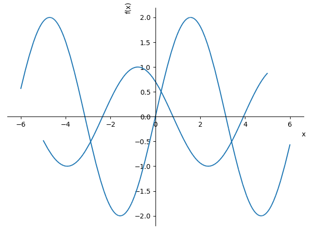
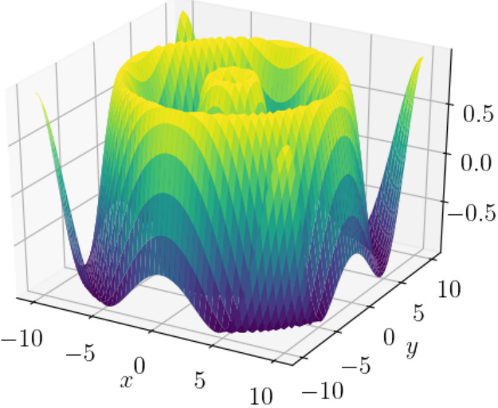
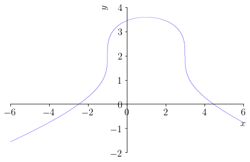

# Python在高等数学&线性代数中的应用（1）

文档负责人：宋奕辰

##  引言

Python在数学计算中的应用，主要采用的库有Numpy、SciPy、SymPy这些库，其中基础数值计算采用的是Numpy和SciPy，符号运算采用的是SymPy库。

## **1. SymPy工具库**

### **1.0 Sympy 简介**
SymPy库具有很强大的符号计算的功能，其中包含有许多模块，如：积分模块（intergrals）、离散数学模块（discrete）、方程求解模块（solvers）、矩阵模块（matrices）、物理学模块（physics）、统计学模块（stats）。对于其中包含的模块，最为常用的其实还是一些符号函数的计算和化简，如计算符号函数的值、化简表达式、求积分等。
<br/> 
<br/>

### **1.1 符号运算相关：**

#### **1.1.1 建立符号变量的方式**

首先导入sympy库（不建议使用*代替）

```python
import sympy
```

接着采用symbols函数建立符号变量

```python
x = sympy.symbols('x')
ver_v = sympy.symbols('v') #ver_v是变量本身，而v是
y,z = sympy.symbols('y z') #利用空格隔开多个符号变量，
m0,m1,m2,m3 = sympy.symbols('m0:4') #创建多个符号变量的另一种方法
print(ver_v) #打印的是变量的“表示方法”，即v
print(type(ver_v))
print(type(sympy.E)) #此处的E的类型是sympy中的number的类型
```

值得注意的是：在后续的符号变量调用中，应该使用的是变量本身，而不是变量的表示方法，即调用时应该使用'ver_v'而非'v'。

注意，sympy中有一些常数以及公式如下：pi，oo（无穷大），E，I

```python
#数学符号以及公式
#虚数单位i
sympy.I
#自然对数低e
sympy.E
#无穷大
sympy.oo
#圆周率
sympy.pi
#求n次方根
sympy.root(8,3)
#求对数
sympy.log(1024,2)
#求阶乘
sympy.factorial(4)
#三角函数
sympy.sin(sympy.pi)
sympy.tan(sympy.pi/4)
sympy.cos(sympy.pi/2)
```

#### **1.1.2 符号变量的赋值以及计算**

```python
import sympy
x = sympy.sin(1) #赋值，注意在使用sin函数时前面要加上sympy
y = sympy.Rational(1,2) #分数的赋值
    #y = 1/2 #直接利用分数赋值会出现报错，变量的格式不匹配
print(x) #结果是x = ......(说明print函数对于symbol对象是打印其表示形式以及值)
print("x=",x.evalf()) 
    #也可写作print("x=",x.n()),默认值为15位，可以自己修改位数
print("pi的两种显示格式：{}，{}".format(sympy.pi,sympy.pi.evalf(3)))
print(type(sympy.pi.evalf())) 
    #若要得到pi的值，则需要使用.evalf()函数调用值(evaluate with float)
print(type(sympy.pi.n()))
    #可以看到，.evalf()和.n()的返回值都是sympy中自带的浮点数类型
```
$\textbf{Out:}$
```
sin(1)
x= 0.841470984807897
pi的两种显示格式：pi，3.14
<class 'sympy.core.numbers.Float'>
<class 'sympy.core.numbers.Float'>
```
#### **1.1.3 表达式的创建以及赋值**

```python
import sympy
y=sympy.symbols('y')
z=sympy.symbols('z')
expr1 = y*sympy.sin(y**2) #符号表达式的创建(注意函数应用时加上前缀)
expr2 = y**2+sympy.sin(y)*sympy.cos(y)+sympy.sin(z)
print("expr1=",expr1)
print("y = 5时，expr1 = ",expr1.subs(y,5)) 
    #代入计算的值，仅仅是将y利用数字代入，并没有得出最后结果，最后结果可以使用.evalf()来求得
print(expr2.subs({y:2,z:3}))
     #双变量赋值，单变量不能用冒号隔开，（利用一个列表代入）
print(expr2.evalf(3)) 
    #此处打印，发现evalf()函数并未给出上述值，说明subs()函数仅仅是“暂时”改变表达式的值
```
$\textbf{Out:}$
```
expr1= y*sin(y**2)
y = 5时，expr1 =  5*sin(25)
sin(2)*cos(2) + sin(3) + 4
y**2 + sin(y)*cos(y) + sin(z)
```
### **1.2 Sympy中的函数介绍：**

#### **1.2.1 对于代数式的变形操作**
主要有：together()、apart()、simplify()、expand()、factor()，使用方式如下：

```python
import sympy 
    #为了方便，也可写 from sympy import simplify
x1,x2,x3,x4 = sympy.symbols('m1:5');x = sympy.symbols('x');y = sympy.symbols('y')
print(x1/x2+x3/x4) 
print(sympy.together(x1/x2+x3/x4)) 
    #合并函数(此处为通分)
print((2*x**2+3*x+4)/(x+1)) 
print(sympy.simplify((2*x**2+3*x+4)/(x+1))) 
    #化简函数，此处化简无效
print(sympy.simplify((x + x**2)/(x*sympy.sin(y)**2 + x*sympy.cos(y)**2))) 
    #有效的化简（还有其他化简如trigsimp三角化简,powsimp指数化简）
print(sympy.apart((2*x**2+3*x+4)/(x+1))) 
    #展开函数（代数式的展开），将分数多项式展开为每一项都不可展开的项
print(sympy.expand((x+1)**2)) #应用分配律
print(sympy.factor(x**2+2*x+1)) #因式分解
```
$\textbf{Out:}$

```
m1/m2 + m3/m4
(m1*m4 + m2*m3)/(m2*m4)
(2*x**2 + 3*x + 4)/(x + 1)
(2*x**2 + 3*x + 4)/(x + 1)
x + 1
2*x + 1 + 3/(x + 1)
x**2 + 2*x + 1
(x + 1)**2
```
#### **1.2.2 初等数学中的应用**
常用函数：solve()、summation()，使用方式如下：
```python
import sympy
x = sympy.Symbol('x')
y = sympy.Symbol('y')
f1 = x+y-3
f2 = x-y+5
f3 = x**2-3*x<10
f4 = x**3-2>20
fx = x*3+y**2
    #三种表示：两个方程一个未知数、一个方程一个未知数、一个方程两个未知数
print(sympy.solve([f1,f2],[x,y])) 
    #输入为solve(表达式，符号参数)，输出为符号参数的一个list，用来表示求解得到的值
print(sympy.solve(sympy.Eq(fx,1),[x,y]))
    #如果方程数目不够，得到的结果是x与y的关系式，得到的是一个list类型的返回值，list的第一项为第一个变量、第二项为第二个变量（用第一个变量表示）
print(sympy.solve([f3,f4],x))
```
$\textbf{Out:}$

```
{x: -1, y: 4}
[(1/3 - y**2/3, y)]
(x < 5) & (22**(1/3) < x)
```
**EXAMPLE:**
$$
\text { 验证 } \sum_{k=1}^{n} k^{2}=\frac{n(n+1)(2 n+1)}{6}, \sum_{k=1}^{\infty} \frac{1}{k^{2}}=\frac{\pi^{2}}{6} .
$$

```python
import sympy
n = sympy.symbols('n')
f = n**(-2)
s = sympy.summation(f,(n,1,sympy.oo)) 
#输入为summation(表达式,(参数,参数范围)),输出为计算得到的值
print(s)
```
$\textbf{Out:}$

```
pi**2/6
```

## **1.3 用SymPy做符号函数画图**

用Sympy做符号函数的画图很方便，其最为重要的是不用解出一个变量对于另一个变量的表达式，即利用隐函数即可作图。下面是一些实例展示：

### **1.3.1 二维曲线画图**
在sympy中，二维曲线画图可以调用plot函数实现。

plot的基本使用格式是：

$$\text{plot(表达式，变量取值范围，属性=属性值)}$$

多重绘制图形则使用：

$$\text{plot(表达式1，表达式2，变量取值范围，属性=属性值) }$$
或者：
$$\text{plot((表达式1，变量取值范围1),(表达式2，变量取值范围2))}$$
**EXAMPLE:**
绘制  $2 \sin x,\ \cos (x+\frac{\pi}{4})$分别在$ x \in [-6,6],[-5,5]$上的图像。
```python
from sympy.plotting import plot
from sympy.abc import x,pi
from sympy.functions import sin,cos
plot((2*sin(x),(x,-6,6)),(cos(x+pi/4),(x,-5,5)))
```



### **1.3.2 三维曲线画图**
**EXAMPLE:** 
绘制 $y_1=\sin x,x\in [-6,6];y_2=\cos (x+\frac{\pi}{4}),x\in [-5,5] $
```python
from pylab import rc  #pylab为matplotlib的接口
from sympy.plotting import plot3d
from sympy.abc import x,y   #引进符号变量x,y
from sympy.functions import sin,sqrt
rc('font',size=16); rc('text',usetex=True) #'font'指的是字体，即调整字体大小到16；text指的是调整文本可以使用tex字体（数字字体）
plot3d(sin(sqrt(x**2+y**2)),(x,-10,10),(y,-10,10),xlabel='$x$',ylabel='$y$')
```


注：怎么调整图片的一些要素建议上网查找，现查现用

### **1.3.3 隐函数画图**

**EXAMPLE:**
绘制 $(x-1)^2+(y-2)^3-4=0 $的图像。

```python
from pylab import rc
from sympy import plot_implicit as pt,Eq #plot_implicit是隐函数绘图函数
from sympy.abc import x,y   #引进符号变量x,y
rc('font',size=16); rc('text',usetex=True)
pt(Eq((x-1)**2+(y-2)**3,4),(x,-6,6),(y,-2,4),xlabel='$x$',ylabel='$y$') #此处，Eq(arg1,arg2)中arg1是方程左边表达式，arg2是方程右边表达式。原因是sympy中的符号方程式不是用=或者==表示，而是用等式Eq表示。当然，此处还可以使用表达式直接画图，就不用使用Eq
pt((x-1)**2+(y-2)**3-4,(x,-6,6),(y,-2,4),xlabel='$x$',ylabel='$y$')
```


或使用匿名函数（lambda函数），亦可得到同样的图像：
```python
from sympy import plot_implicit as pt
from sympy.abc import x,y #引进符号变量x,y
ezplot = lambda expr:pt(expr) #expr是表达式的意思，不需要提前声明
ezplot((x-1)**2+(y-2)**3-4)
#上述操作等效于下面一句：
pt((x-1)**2+(y-2)**3-4)
```


**补充内容：** lambda函数的使用

lambda函数的基本使用形式是：

```python
name = lambda 变量 : 表达式 #声明一个lambda函数
name(变量的值)
```

lambda函数的优点：单行，轻便，即用即扔（不需要特地去建立一个正式的函数）.

### **1.4 官方文档**
更多的sympy的函数的用法，可参考官方文档：

[Welcome to SymPy’s documentation! — SymPy 1.9 documentation](https://docs.sympy.org/latest/index.html)

## **2 Scipy工具库**

### **2.0 Scipy 简介**
SciPy是以NumPy为基础，一个应用更加广泛的科学计算工具库，他与Numpy的区别就是对于一些高级函数进行封装可供直接调用。下面是一些模块的简单介绍：

### **2.1 积分模块（scipy.integrate）**

积分模块分为：给定函数的数值积分、给定离散点的数值积分、微分方程的数值解，一些函数距离如下：

- 给定函数的数值积分

| 函数名     | 函数说明                               |
| ---------- | -------------------------------------- |
| quad       | 一重数值积分                           |
| dblquad    | 二重数值积分                           |
| tplquad    | 三重数值积分                           |
| nquad      | 通用$N$重积分                          |
| fixed_quad | 使用固定阶高斯求积公式求数值积分       |
| quadtature | 使用固定误差限的高斯求积公式求数值积分 |
| romberg    | 求函数的Romberg数值积分                |

- 给定离散点的数值积分

| 函数名   | 函数说明                                        |
| -------- | ----------------------------------------------- |
| cumtrapz | 用梯形法求数值积分                              |
| simps    | 用辛普森法求数值积分                            |
| romb     | 用Romberg积分法求自变量均匀间隔离散点的数值积分 |

- 微分方程的数值解

| 函数名      | 函数说明                                |
| ----------- | --------------------------------------- |
| odeint      | 使用Fortran库中方法求微分方程组的数值解 |
| ode         | 求一般微分方程组的数值解                |
| complex_ode | 求复微分方程组的数值解                  |

示例代码如下所示：

```python
from scipy import integrate
import numpy as np
import matplotlib.pyplot as plt
def func1(x):
    return x*x
def func2(x,y):
    return x*y
print(integrate.quad(func1,0,1))
print(integrate.dblquad(func2,0,1,0,1))
print(integrate.fixed_quad(func1,0,1))
print(integrate.romberg(func1,0,1))
z = np.linspace(-2,2,num = 20)#梯形法的插值点
print(integrate.cumtrapz(z))#梯形法
#...more to explore
```
$ \textbf{Out:}$
```
(0.33333333333333337, 3.700743415417189e-15)
(0.24999999999999997, 5.539061329123429e-15)
(0.33333333333333326, None)
0.3333333333333333
[-1.89473684e+00 -3.57894737e+00 -5.05263158e+00 -6.31578947e+00
 -7.36842105e+00 -8.21052632e+00 -8.84210526e+00 -9.26315789e+00
 -9.47368421e+00 -9.47368421e+00 -9.26315789e+00 -8.84210526e+00
 -8.21052632e+00 -7.36842105e+00 -6.31578947e+00 -5.05263158e+00
 -3.57894737e+00 -1.89473684e+00 -2.22044605e-15]
```
注：前三行的后面一项为相应方法的误差。

### **2.2 线性代数模块（scipy.linalg）**

在官方文档中，对于scipy中的linalg模块的介绍如下：scipy.linalg contains all the functions in numpy.linalg. plus some other more advanced ones not contained in numpy.linalg.（来源于numpy但是超越了numpy）。

**EXAMPLE:** 对矩阵$A$进行一些常用操作
```python
import numpy as np
from scipy import linalg
A = np.array([[1,3,5],[2,5,1],[2,3,8]])
print(linalg.inv(A)) 
    #矩阵求逆的运算
print(A.dot(linalg.inv(A))) 
    #验算（通过A和其逆相乘来判断计算的准确程度）
print(linalg.det(A))
    #求行列式
    #...more to explore
```
$ \textbf{Out:}$
```
[[-1.48  0.36  0.88]
 [ 0.56  0.08 -0.36]
 [ 0.16 -0.12  0.04]]
[[ 1.00000000e+00 -1.11022302e-16 -6.24500451e-17]
 [ 3.05311332e-16  1.00000000e+00  1.87350135e-16]
 [ 2.22044605e-16 -1.11022302e-16  1.00000000e+00]]
-25.00000000000000
```

### **2.3 优化模块（scipy.optimize）**

优化模块内含解决单变量和多变量的目标函数最小值问题的功能。它通过大量的算法解决最小化问题。优化模块支持线性回归、搜索函数的最大值与最小值、方程求根、线性规划、拟合等功能。

**EXAMPLE:**
对(x,y)线性拟合，x、y的值见程序

```python
import numpy as np
from scipy import optimize
x = np.array([8.19,2.72,6.39,8.71,4.7,2.66,3.78])
y = np.array([7.01,2.78,6.47,6.71,4.1,4.23,4.05])

def residual(p):
    k,b = p
    return y-(k*x+b)

r = optimize.leastsq(residual,[1,0]) #最小二乘法的拟合
k,b = r[0]
print(k)
print(b)
```
$ \textbf{Out:}$
```
0.6134953491930442
1.794092543259387
```
### **2.4文件读写（scipy.io）**

scipy.io模块中，有一点值得注意的是，此模块可以导入或者生成matlab中的数据文件.mat文件，具体实现代码和调用如下所示：

```python
from scipy import io
x = np.array([8.19,2.72,6.39,8.71,4.7,2.66,3.78])
y = np.array([7.01,2.78,6.47,6.71,4.1,4.23,4.05])
data ={}
data['x']=x
data['y']=y
io.savemat('datafile.mat',data)
test_data = io.loadmat('test_data.mat')
print(test_data)
print(test_data['test_data']) #引用时写变量名用于引用
```
```
{'__header__': b'MATLAB 5.0 MAT-file, Platform: PCWIN64, Created on:', '__version__': '1.0', '__globals__': [], 'test_data': array([[ 1,  2,  3,  4,  5],
       [ 6,  7,  8,  9, 10]], dtype=uint8)}
[[ 1  2  3  4  5]
 [ 6  7  8  9 10]]
<class 'numpy.ndarray'>
```
### **2.5 官方文档**
当然，除了上述模块以外，scipy还有很多值得探索的功能，在数学计算中，scipy可以说是无所不能。需要学习更多内容的话，欢迎阅读scipy官方文档：

[SciPy User Guide — SciPy v1.7.1 Manual](https://docs.scipy.org/doc/scipy/reference/tutorial/index.html#user-guide)

