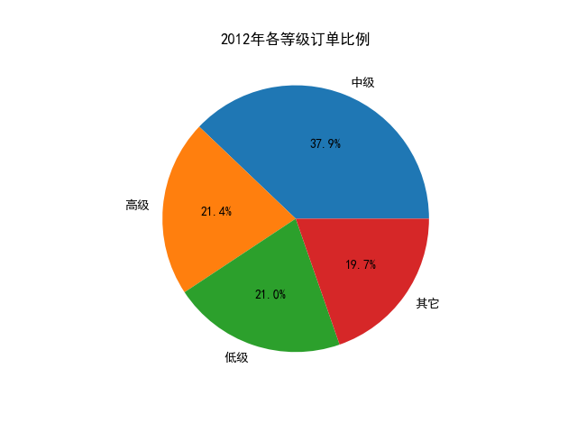
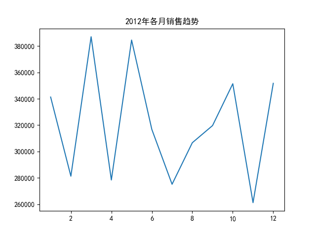
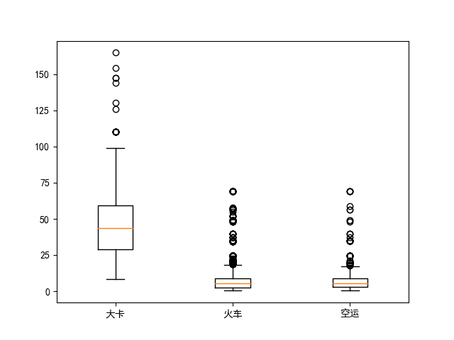
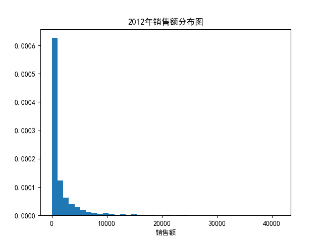
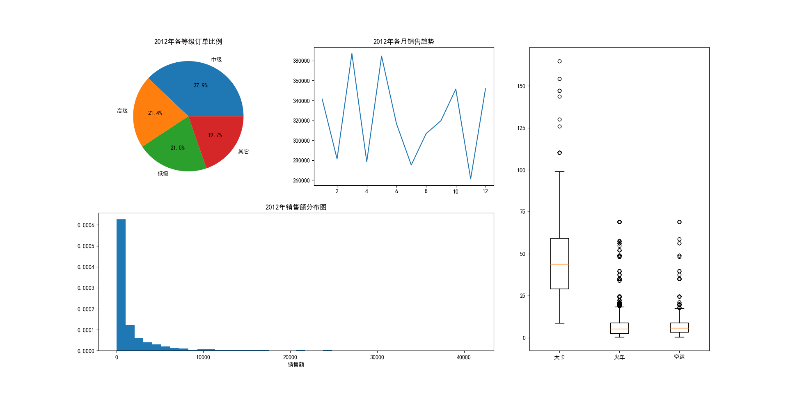

# Numpy & Pandas & Matplotlib 综合运用

文档负责人：宋奕辰

## 目标：
对"./Trade.xlsx"的数据进行分析与可视化操作。

### **前置操作**
#### **导入包**
```python
import numpy as np
import pandas as pd
import matplotlib.pyplot as plt
```


#### **数据读取、图片显示设置**

```python
df0=pd.read_excel("Trade.xlsx")    #df0代表原始数据
df0['year']=df0.Date.dt.year       #添加交易年份字段
df0['month']=df0.Date.dt.month     #添加交易月份字段
plt.rc('font',family='SimHei') #用来正常显示中文标签
```

#### **数据预览**
可以利用pandas Dataframe的head属性预览前5条数据，当数据量极大的情况下，比Excel快（Excel需要加载所有数据之后才能看到前几行的情况）。
```python
print(df0.head())
```
$ \textbf{Out:}$
```
        Date Order_Class      Sales Transport  ...  Category Box_Type  year month
0 2010-10-13          低级   261.5400        火车  ...      办公用品     大型箱子  2010    10
1 2012-02-20          其它     6.0000        火车  ...      办公用品     小型包裹  2012     2
2 2011-07-15          高级  2808.0800        火车  ...      家具产品     中型箱子  2011     7
3 2011-07-15          高级  1761.4000        大卡  ...      家具产品     巨型纸箱  2011     7
4 2011-07-15          高级   160.2335        火车  ...      技术产品     中型箱子  2011     7
```

### **TASK1:** 2012年各等级订单比例
```python
ax1=plt.subplot(1,1,1)  #创建图
#ax1=plt.subplot(2,3,1) #左上角的子图
Class_Counts=df0.Order_Class[df0.year==2012].value_counts()
Class_Percent=Class_Counts/Class_Counts.sum()
ax1.set_aspect(aspect='equal')  #设置纵横轴比例相等
ax1.pie(Class_Percent,labels=Class_Percent.index,
        autopct="%.1f%%")  #添加格式化的百分比显示
ax1.set_title("2012年各等级订单比例")
plt.show()
```

### **TASK2:** 2012年各月销售趋势
```python
ax2=plt.subplot(1,1,1)
#ax2=plt.subplot(2,3,2)  #建立第2个子图窗口
#统计2012年每月销售额
Month_Sales=df0[df0.year==2012].groupby(by='month').aggregate({'Sales':np.sum})

#下面使用Pandas画图
Month_Sales.plot(title="2012年各月销售趋势",ax=ax2, legend=False)
ax2.set_xlabel('')
```

### **TASK3:** 各种交通运输方式的价格分布箱型图
```python
ax3=plt.subplot(1,1,1)
#ax3=plt.subplot(2,3,(3,6))#右侧两块区域
cost=df0['Trans_Cost'].groupby(df0['Transport'])
ts = list(cost.groups.keys())
dd = np.array(list(map(cost.get_group, ts)))
plt.boxplot(dd); plt.gca().set_xticklabels(ts)#箱型图
```

### **TASK4:** 2012年销售额分布图
```python
ax4=plt.subplot(1,1,1)
#ax4=plt.subplot(2,3,(4,5))#左下方两块区域
plt.hist(df0.Sales[df0.year==2012],bins=40, density=True)
ax4.set_title("2012年销售额分布图");
ax4.set_xlabel("销售额");
plt.savefig("figure2_45.png");
plt.show()
```

### **将所有图整合到一起**
我们将上述的命令中的第一行(1,1,1)改为我们需要的位置，如按照注释修改后，得到下图：


## 结语
Matplotlib 的技术细节还是很多的，详情可以参考其官方网站：https://matplotlib.org/
